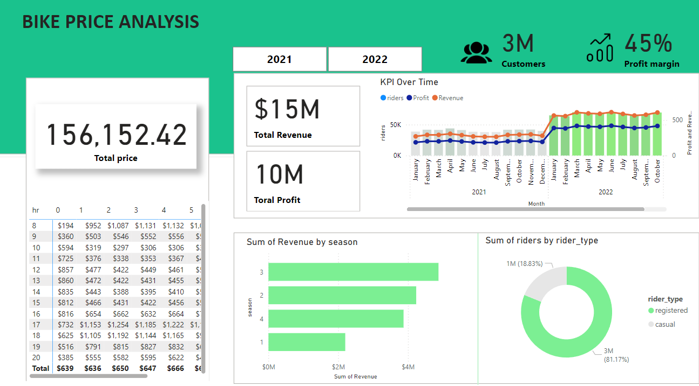

# Bike Sales Dashboard

This project presents a dynamic **Bike Sales Dashboard** developed using **SQL** and **Power BI**. The dashboard provides a comprehensive analysis of bike sales, showcasing key metrics like profit, revenue, total riders, and rider type distribution, all on a single, user-friendly page.

## Table of Contents
- [Overview](#Overview)
- [Process and Workflow](#Process-and-Workflow)
- [Dashboard Components](#Dashboard-Components)
- [Key Insights](#Key-Insights)
- [Suggestion](#Suggestion)
- [Tools Used](#Tools-Used)
- [How to Use the Dashboard](#How-to-Use-the-Dashboard)
- [Future Enhancements](#Future-Enhancements)
- [Contact](#contact)

## Project Overview

The objective of this project was to transform raw bike sales data into actionable insights, focusing on the requirements of hourly revenue analysis, profit and revenue trends, seasonal revenue, and rider demographics. By building a structured database and leveraging SQL for data integration, the final output is an interactive Power BI dashboard that highlights critical business performance indicators and trends.

## Process and Workflow

### 1. **Building the Database**
- Constructed a relational database to manage and organize bike sales data efficiently.
- Imported and structured three essential datasets:
  1. **Sales Data**: Contains details about sales transactions.
  2. **Rider Information**: Provides data on customer demographics and rider types.
  3. **Time Data**: Includes timestamps for analyzing sales trends.
- Ensured the data was clean and accurate for reliable analysis.

### 2. **Data Integration Using SQL**
- Utilized **SQL** to join and merge the datasets into a cohesive structure.
- Performed data cleaning, filtering, and aggregation to prepare the data for visual representation.
- Exported the refined and integrated dataset as a CSV file for Power BI visualization.

### 3. **Data Visualization in Power BI**
- Imported the cleaned dataset into Power BI to create a visually appealing dashboard.
- Focused on presenting key metrics and insights using clear and intuitive visualizations.

## Dashboard Components

### **Screenshot of the Dashboard**

   

### **Project** :  [Bike-sales-Dashboard](assets/project/Bike_sales.pbix)

### 1. **Column Chart**
- Illustrates the **Profit**, **Revenue**, and **Total Riders**.
- Helps identify patterns and trends over time in the company’s performance.

### 2. **Pie Chart**
- Displays the **distribution of rider types**:
  - **Casual Riders**: Short-term, infrequent users.
  - **Registered Riders**: Long-term, frequent users.
- Highlights the proportion of each customer segment, offering insights into target audiences.

### 3. **KPI Cards**
- **Total Revenue**: The overall revenue generated from bike sales.
- **Total Riders**: The cumulative number of bike riders.
- **Total Profit**: The total profit earned.
- **Profit Margin**: The percentage of revenue that remains as profit after expenses.

### 4. **Revenue Table**
- Provides a detailed view of **revenue distribution**:
  - **Rows**: Represent hours of the day.
  - **Columns**: Represent weekdays.
- Assists in understanding revenue trends based on time and day, revealing peak business hours.

## Key Insights
1. **Price and Profit Margin Increase**:
   - A **25% increase in profit margin** was achieved by adjusting pricing strategies, resulting in significantly higher profitability without negatively impacting demand.

2. **Demand Surge**:
   - There was a **64% increase in overall demand**, indicating a strong customer interest, likely influenced by market trends or promotional efforts.

3. **Correlation Between Price and Demand**:
   - Despite a 25% price increase, demand surged by 64%, suggesting that customers perceive high value in the product, indicating effective marketing and customer loyalty programs.

4. **Peak Revenue Hours**:
   - The revenue table analysis shows that weekday mornings and early evenings generate the most sales, making these times crucial for targeted marketing and operational planning.

5. **Rider Type Distribution**:
   - Registered riders make up a more significant portion of revenue compared to casual riders, highlighting the importance of retaining and growing the registered customer base.

## Suggestion
1. Since prices went up a lot last year, it’s smart to be careful this time. We don’t want to make the price so high that people stop buying. A small increase, like 10-15%, is a good way to see how people react without losing too many customers.
2. Check how happy customers are, what other companies are doing, and how the economy is doing. This helps decide whether to go with a smaller or bigger increase.
3. Maybe have one price for casual buyers and another for regular users, because they might be willing to pay differently.
4. Try the new prices but pay close attention to how people react. If it doesn’t work well, be ready to change quickly so you don’t lose customers.

## Tools Used
- **SQL**: For data integration, cleansing, and transforming raw datasets into a usable format.
- **Power BI**: For building an interactive dashboard and visualizing key insights.
- **Database Management System**: To store and manage large datasets efficiently.

## How to Use the Dashboard
1. Download and open the Power BI file to explore the dashboard.
2. Interact with the visual elements to discover trends and insights.
3. Use any available filters or slicers to customize your analysis further.

## Future Enhancements
- Introduce filters for a more granular analysis, such as filtering by location, customer demographics, or sales channels.
- Expand the dashboard to include time series forecasting and predictive analysis for better strategic planning.
- Incorporate additional KPIs and visualizations to track marketing performance and customer satisfaction metrics.

## Contact
- [Sahil Patra]
- [+91 7735367833]
- [sahilpatra1004@gmail.com]
- [[LinkedIn Profile](https://www.linkedin.com/in/sahil-patra10)]
